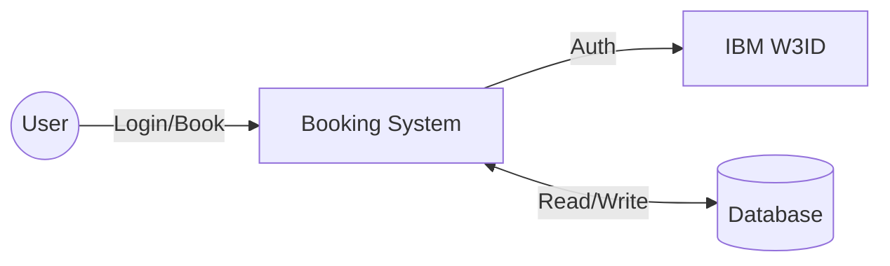
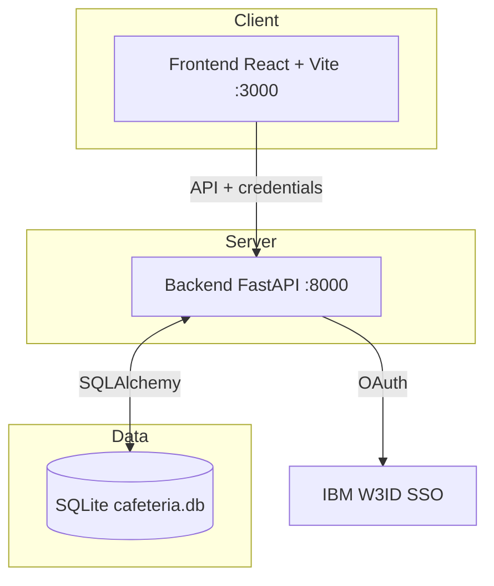

# Architecture Documentation

## Data Flow Diagram (DFD)

## System Architecture

## Component Overview

| Component | Technology | Port |
|-----------|------------|------|
| Frontend | React, Vite, Tailwind | 3000 |
| Backend | FastAPI | 8000 |
| Database | SQLite (dev) / PostgreSQL (prod) | - |
| Auth | IBM W3ID OIDC | - |

Diagrams above are in Mermaid format and render in GitHub, VS Code, and most markdown viewers. No additional install required.
